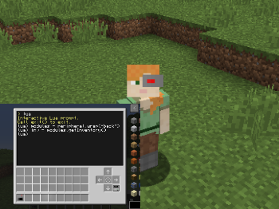

## The neural interface
The neural interface is a wearable computer with support for peripherals and modules alike. The key difference between
this and the manipulator is that modules have direct access to the wearer. The use of this becomes apparent when you
consider the kinetic augment, which provides methods to control the wearer.

To get started, craft a neural interface and a neural connector. You can place the neural interface in your helmet slot
or right click another entity to place it in theirs.

> **Note:** You can't place a neural interface on child mobs: that is just cruel. You should also be warned that once
> placed on a mob, the neural interface cannot be removed. Their brains are not as resilient to tampering as human
> brains are.

> **Note:** If a neural interface doesn't show up on a mob, it probably means it is a modded
> mob. Please [file an issue](https://github.com/SquidDev-CC/plethora/issues/new) with a link to the mod and the name of
> the mob.

Now that you've placed the neural interface, right click the mob you placed it on, or the air if you placed it on
yourself. You should receive a GUI not dissimilar to a turtle's. On the right you have slots for the peripherals which
are mounted on the neural interface. Clicking the disk drive will toggle between showing peripherals and modules.

Like turtles, the only supported ComputerCraft peripherals are wireless modems. However, there is also support for other
mod's peripherals, such as CCTweaks' wireless bridge.

All modules which can be placed in a manipulator can also be placed in a neural interface. They will continue to
function as before. There are some modules which require the neural interface, or function best with it. Modules can be
found mounted on the "back" slot of a computer, bundled together in a manipulator-like peripheral. Wrapping this
peripheral will provide you with the same methods as an equivalent manipulator.

### The introspection module
The introspection module provides access to the inventory of the wearing entity, as well as useful information such as
the entity name and id.

> **Note:** It is possible to use the introspection upgrade in a manipulator by shift+right-clicking it to "bind" it to
> yourself. This obviously doesn't work for mobs though.

### The kinetic augment
The kinetic augment allows controlling the owning entity. Whilst this does have limited support for players, most
methods require a mob of some sort. The method you'll probably want to get started with is `.disableAI()` which, as the
name suggests, prevents the mob from wandering around doing its own thing.

> **Note:** Some mob's instincts are just too ingrained in their psyche, even the neural interface cannot stop them
> doing what they're gonna do.

One useful method is the `.walk(x, y, z)` method, which directs a mob to path-find to a position, ready to carry out
your nefarious commands. Of course, if you want to get there faster, you can always use `.launch(yaw, pitch, power)`
which contorts your muscles, launching you into the air in a hulk-like fashion.

Some mobs have their own specific methods, such as `.shoot()` on skeletons, `.teleport()` on endermen and `.explode()`
on creepers. Do with that what you will. I hold no responsibility.

> **Note:** Be warned, the neural interface is a fragile piece of equipment and cannot withstand the force of creeper's
> explosions.
